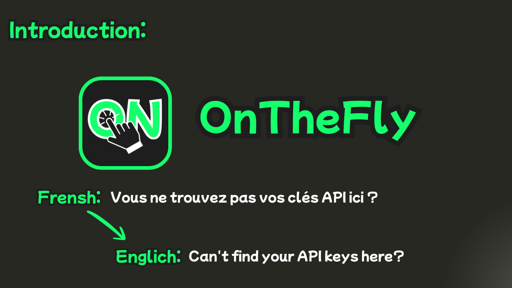
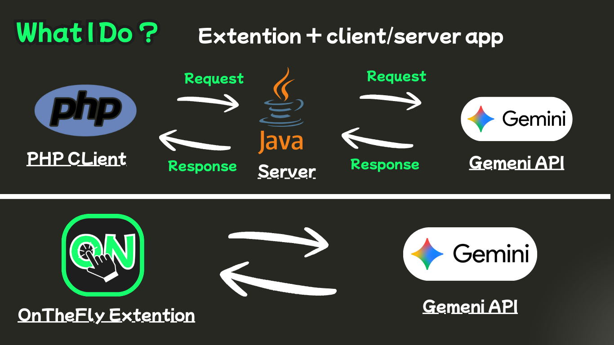

## Video Link: https://youtu.be/HXlM3S8YNUk

<div align="center">
    
    <h2>OnTheFly Extension</h2>
</div>




### Introduction
This project aims to implement an LLM-powered RESTful web service for
translating from English to Moroccan Arabic Dialect (Darija) or Any Other Language.
The translation task is performed by an LLM (Large Language Model) in my case I using ****

in Slide1 you see that we translate from Frensh to Englich,
I am make the project general means we can use it to translate from any to any language.




### What I Do?
I implemented two tasks: a client/server app using JAX-RS because I am working with REST architecture, and an extension using Manifest V3.

**For Client/Server App:** I built it using JAX-RS on the server side and PHP on the client side. The client sends a request, basically a translation task, and the API sends it to another server, Gemini, because I used the Gemini API (you may find the project does not work because it is a free API and has limitations). So get your API key from this: https://aistudio.google.com/api-keys, and then we send a response to the client as JSON data that contains the translation.

**For Extension:** A part where we use the manifest to create a visual UI with buttons and inputs to enter text and translate it into another language. When we click the translate button, we send a direct request to the Gemini API, get the response, and display it.


### Fork it Know
If you want to use or improve this project, you can fork it.

#### How to Fork:

``` bash
1. Click the **Fork** button at the top right of this repository.

2. Clone your forked repository to your local machine: ## git clone git@github.com:KaraniAbdellah/TextFlyTranslator.git

3. Open the project in your IDE.

For the Client/Server App You Will Need:
- Java (JDK)
- WildFly Server (I am using WildFly 27)
- PHP
- Gemini API Key # FROM: https://aistudio.google.com/api-keys

For the Extension:
- Google Chrome OR ANY BROWSER
- Enable Developer Mode in `chrome://extensions/`
- Load the extension using **Load unpacked**
After that, configure your Gemini API key and run the project. # in config.js
```

**made with LOVE by <a href="https://www.linkedin.com/in/abdellah-karani-965928294/">ME</a>**

