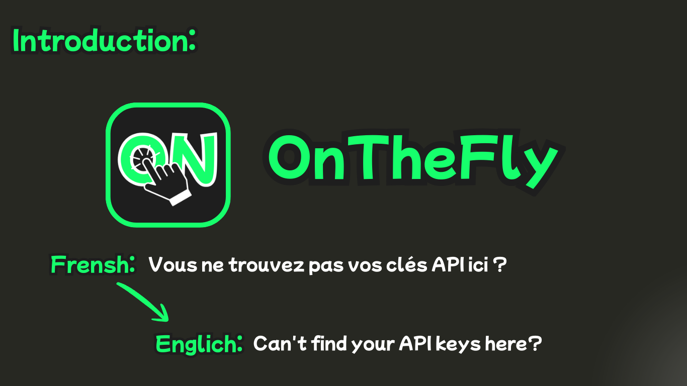
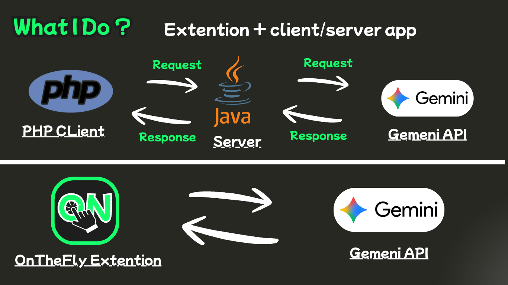

<div align="center">
    
    <h2>OnTheFly Extension</h2>
    <a href="https://www.linkedin.com/in/abdellah-karani-965928294/" target="_blank">
        
    </a>
    <a href="https://x.com/karani66745" target="_blank">
        
    </a>
</div>




### Introduction
This project aims to implement an LLM-powered RESTful web service for
translating from English to Moroccan Arabic Dialect (Darija) or Any Other Language.

The translation task is performed by an LLM (Large Language Model) in my case I using **Gemeni API**

in Slide1 you see that we translate from Frensh to Englich,
I make the project general wich means we can use it to translate from any to any language.

### Full Overview


---

## 🏗️ Architecture

This project implements two complementary solutions:

### 1️⃣ **Client/Server Application**
```
Client (PHP) → JAX-RS Server → Gemini API → Response (JSON)
```
- **Backend**: JAX-RS (Java RESTful Web Services)
- **Frontend**: PHP Client
- **AI Engine**: Google Gemini API

### 2️⃣ **Browser Extension**
```
Extension UI → Direct API Call → Gemini API → Display Result
```
- **Manifest**: V3 (Latest Chrome Extension Standard)
- **Interface**: HTML/CSS/JavaScript
- **Integration**: Direct Gemini API connection

---

## 🚀 Getting Started

### 📋 Prerequisites

<table>
<tr>
<td width="50%">

#### For Client/Server App:
- **Java JDK** (11 or higher)
- **WildFly Server** (v27 recommended)
- **PHP** (7.4+)
- **Gemini API Key**

</td>
<td width="50%">

#### For Browser Extension:
- **Google Chrome** (or any Chromium browser)
- **Developer Mode** enabled
- **Gemini API Key**

</td>
</tr>
</table>

---

## 📥 Installation

### Step 1: Fork & Clone

```bash
# Fork this repository using the button above, then:
git clone git@github.com:YourUsername/TextFlyTranslator.git
cd TextFlyTranslator
```

### Step 2: Get Your API Key

> Obtain your free Gemini API key from:  
> **https://aistudio.google.com/api-keys**

⚠️ **Note**: The free API has rate limits.

### Step 3: Configuration

#### For the Extension:
```javascript
// In config.js, add your API key:
const GEMINI_API_KEY = "your_api_key_here";
```

#### For the Server:
```java
// Configure in your server configuration file
# add your api key to editor (env vars)
```

### Step 4: Run the Project

<details>
<summary><b>🖥️ Running the Client/Server App</b></summary>

1. **Deploy to WildFly:**
   ```bash
   # Build the project
   mvn clean package
   
   # Deploy to WildFly
   cp target/your-app.war $WILDFLY_HOME/standalone/deployments/
   ```

2. **Start WildFly:**
   ```bash
   $WILDFLY_HOME/bin/standalone.sh
   ```

3. **Run PHP Client:**
   ```bash
   php -S localhost:8000
   ```

</details>

<details>
<summary><b>🧩 Installing the Extension</b></summary>

1. Open Chrome and navigate to `chrome://extensions/`
2. Enable **Developer Mode** (toggle in top right)
3. Click **Load unpacked**
4. Select the extension directory from this project
5. The OnTheFly icon should appear in your extensions bar! 🎉

</details>

---

## 🎥 Video Demo

<div align="center">

### 📺 Watch the Full Tutorial

[](https://youtu.be/HXlM3S8YNUk)

*Click above to see OnTheFly in action!*

</div>

---

## 🛠️ Technology Stack

<div align="center">


</div>

---

## 🤝 Contributing

Contributions are what make the open-source community amazing! Any contributions you make are **greatly appreciated**.

1. Fork the Project
2. Create your Feature Branch (`git checkout -b feature/AmazingFeature`)
3. Commit your Changes (`git commit -m 'Add some AmazingFeature'`)
4. Push to the Branch (`git push origin feature/AmazingFeature`)
5. Open a Pull Request

---

## 💬 Contact & Support

<div align="center">

**Questions? Suggestions? Let's connect!**

[](https://www.linkedin.com/in/abdellah-karani-965928294/)
[](https://x.com/karani66745)

</div>

---

<div align="center">

### ⭐ If you find this project helpful, please give it a star!

**Made with ❤️ by [Abdellah Karani](https://www.linkedin.com/in/abdellah-karani-965928294/)**

</div>
